# minikube-005
Build a Kubernetes Cluster Locally with Minikube
Deploy and manage applications on Kubernetes using Minikube and kubectl.


---

###  Tools - Install kubectl and Minikube


Versions:

```
kubectl version --client
# Client Version: v1.31.0
# Kustomize Version: v5.4.2

minikube version
# minikube version: v1.37.0
```
---


### 1. Start Minikube (Using Docker Driver)
```
minikube start --driver=docker
```
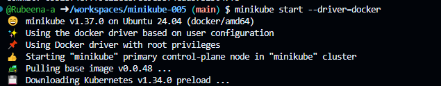
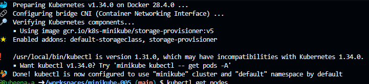

### 2: Check Cluster Nodes
```
kubectl get nodes
```
```
NAME       STATUS   ROLES           AGE   VERSION
minikube   Ready    control-plane   8s    v1.34.0

```

### 3: Deploy & Verify
1. Apply manifest
```
kubectl apply -f deployment.yaml
# deployment.apps/my-nginx created

kubectl apply -f service.yaml
# service/my-nginx-svc created

```


2. Verify Resources
- Deployments
```
kubectl get deployments

```
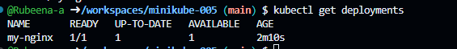

- Pods
```
kubectl get pods -o wide
```
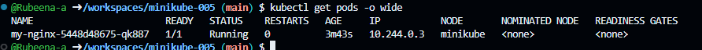

- Services
```
kubectl get svc
```
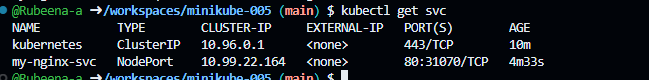

### 4: Access the service
```
minikube service my-nginx-svc --url
```
Output:
http://192.168.49.2:31070
then Run,
```
minikube tunnel
```
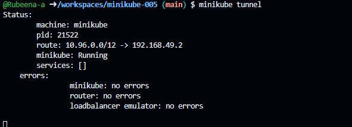

### 5: Check Logs and Pod Details
- Logs
```
 kubectl logs my-nginx-5448d48675-qk887
 ```
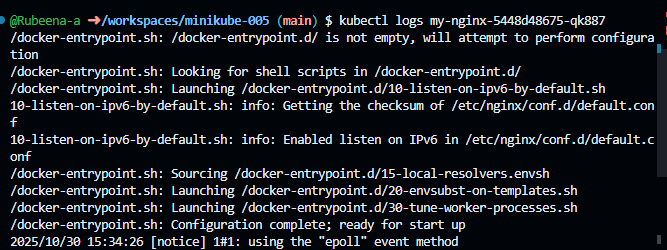
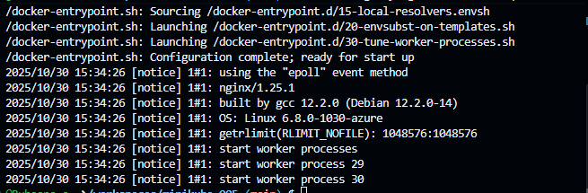

- Describe Pod:
```
kubectl describe pod my-nginx-5448d48675-qk887
```

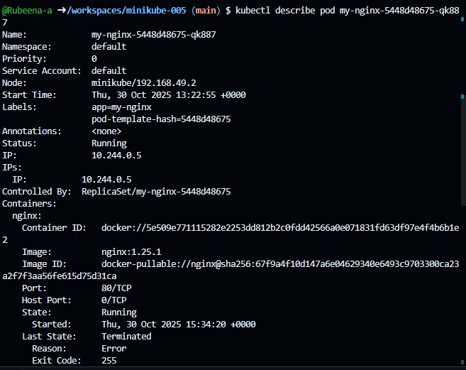

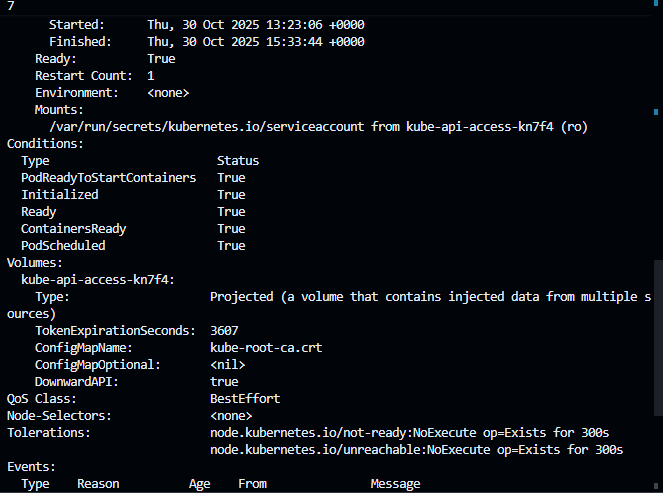

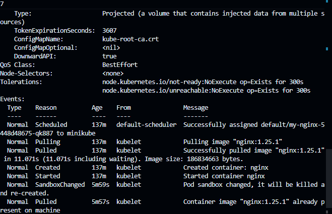

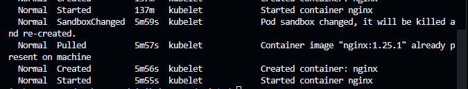

- Test via Curl:
```
curl http://192.168.49.2:31070
```


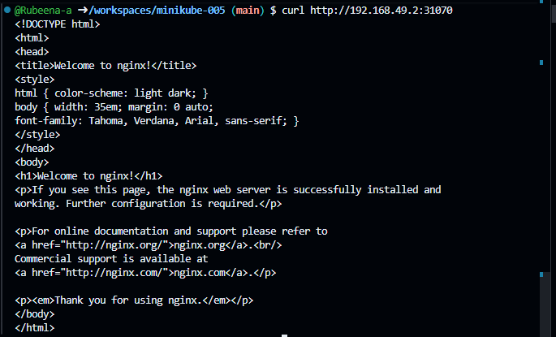

### 6: Scale and Update

- Scale replicas
```
kubectl scale deployment/my-nginx --replicas=3

kubectl get pods
```
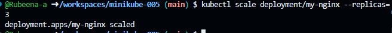

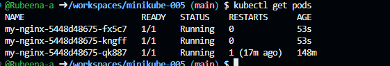


- Rolling update
```
kubectl set image deployment/my-nginx nginx=nginx:1.26.0 --record

kubectl rollout status deployment/my-nginx
```
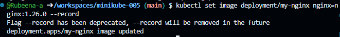

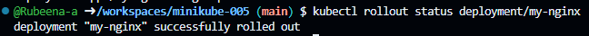


### 7: Namespace & ConfigMap

```
kubectl create namespace demo

kubectl create configmap demo-config --from-literal=GREETING="Hello from ConfigMap" -n demo

kubectl get configmap -n demo

```
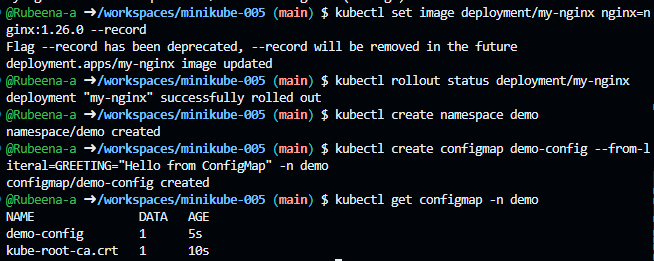

### Author
Rubeena Shaik
